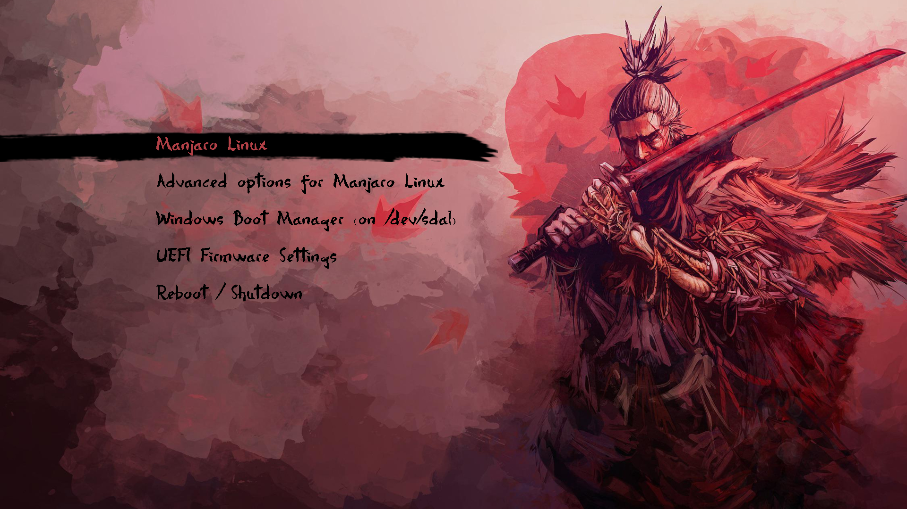

# Sekiro Limine Theme

Tema visual inspirado en Sekiro para el gestor de arranque [Limine](https://github.com/limine-bootloader/limine).

Este proyecto adapta los recursos visuales del tema original de GRUB a las
opciones que ofrece Limine. El fondo, la resolución, el branding y los colores
se configuran mediante `limine.conf`.

## Estado del proyecto

El instalador está preparado para Limine. No utiliza `theme.txt`,
`/etc/default/grub`, `update-grub`, `grub-mkconfig` ni `grub-mkfont`.

Los archivos originales de GRUB se mantienen dentro de `Sekiro/` como recursos
del proyecto, pero los archivos `.pf2` y la configuración `theme.txt` no se
cargan en Limine porque pertenecen al formato de temas de GRUB.

## Características

El instalador realiza estos pasos:

1. Comprueba los permisos de usuario y se relanza mediante `sudo` cuando es necesario.
2. Muestra un banner del tema.
3. Busca automáticamente `limine.conf` en las rutas habituales.
4. Permite elegir manualmente la configuración con `--config`.
5. Detecta los fondos disponibles y pregunta qué resolución utilizar.
6. Crea un backup fechado de `limine.conf` antes de modificarlo.
7. Copia el fondo seleccionado al volumen donde se encuentra la configuración.
8. Añade un bloque marcado de configuración de Sekiro.
9. Conserva intactas las entradas existentes de Linux, Windows y otros sistemas.
10. Comprueba que el fondo y la configuración se han instalado correctamente.
11. Muestra la orden exacta para restaurar el backup.

El instalador puede ejecutarse varias veces. Cada ejecución elimina y vuelve a
crear únicamente su propio bloque entre:

```text
# BEGIN SEKIRO LIMINE THEME
# END SEKIRO LIMINE THEME
```

No se regeneran ni se reescriben las entradas de arranque existentes.

## Archivos

```text
install.sh       Instalador del tema para Limine
uninstall.sh     Restauración del backup y eliminación de los recursos
Sekiro/          Fondos y recursos gráficos del tema original
README.md        Documentación del proyecto
screenshot.png   Captura del diseño original
```

Los fondos disponibles actualmente son:

```text
Sekiro/sekiro_1920x1080.png
Sekiro/sekiro_2560x1440.png
```

## Instalación

Clona el repositorio:

```bash
git clone https://github.com/Meliodas-96/sekiro_limine_theme.git
cd sekiro_limine_theme
```

Si el sistema no conserva los permisos ejecutables de los scripts:

```bash
chmod +x install.sh uninstall.sh
```

Ejecuta el instalador:

```bash
sudo ./install.sh
```

El instalador buscará automáticamente la configuración de Limine. Si encuentra
varias configuraciones, mostrará una lista para elegir la correcta.

También se puede indicar directamente la ruta:

```bash
sudo ./install.sh --config /boot/limine.conf
```

Para seleccionar directamente el fondo de 1920x1080:

```bash
sudo ./install.sh \
  --config /boot/limine.conf \
  --resolution 1920x1080
```

Las opciones disponibles son:

```text
--config RUTA       Ruta exacta del archivo limine.conf
--resolution MODO   Resolución del fondo, por ejemplo 1920x1080
--yes               Omite la confirmación final
--help              Muestra la ayuda
```

## Detección de Limine

El instalador comprueba estas rutas habituales:

```text
/boot/limine.conf
/boot/limine/limine.conf
/boot/efi/EFI/limine/limine.conf
/boot/efi/EFI/BOOT/limine.conf
/efi/EFI/limine/limine.conf
/efi/EFI/BOOT/limine.conf
```

Limine puede buscar su configuración en distintas ubicaciones dependiendo del
modo de arranque y de cómo se haya instalado. Por eso se recomienda utilizar
`--config` si el sistema usa una ruta personalizada.

El instalador modifica la configuración seleccionada, no cualquier archivo de
GRUB que pueda existir en el sistema.

## Configuración generada

Para una instalación a 1920x1080, el instalador añade un bloque equivalente a

```ini
# BEGIN SEKIRO LIMINE THEME
# Generated by sekiro_grub_theme. Do not edit this block manually.
graphics: yes
interface_resolution: 1920x1080
wallpaper: boot():/themes/Sekiro/sekiro_1920x1080.png
wallpaper_style: stretched
interface_branding: Sekiro
interface_branding_colour: b14046
interface_help_colour: b14046
interface_help_colour_bright: f0a0a0
term_background: 80000000
term_foreground: ffffff
term_background_bright: 40000000
term_foreground_bright: ffffff
term_margin: 64
term_margin_gradient: 8
term_palette: 120b0b;8f1d2c;5f6b3a;b8863b;3e4b6b;7d3152;557a78;d8c9b0
term_palette_bright: 4d4141;d94b5b;93a85b;e0b85c;6477a8;bd5e8a;7da9a2;fff4dc
# END SEKIRO LIMINE THEME
```

Estas opciones son opciones globales documentadas por Limine:

- `graphics: yes` fuerza la interfaz gráfica.
- `interface_resolution` solicita la resolución de la interfaz de Limine.
- `wallpaper` define el fondo del menú.
- `wallpaper_style: stretched` adapta el fondo a la pantalla.
- `interface_branding` muestra el nombre del tema en la interfaz.
- `interface_branding_colour` cambia el color del branding.
- `interface_help_colour` cambia el color de los textos de ayuda.
- `interface_help_colour_bright` cambia el color brillante de la cuenta atrás.
- `term_background` aplica transparencia al fondo del terminal gráfico.
- `term_foreground` define el color principal del texto.
- `term_background_bright` y `term_foreground_bright` controlan los colores brillantes.
- `term_margin` y `term_margin_gradient` integran el panel del menú sobre el fondo.
- `term_palette` y `term_palette_bright` sustituyen la paleta básica por tonos oscuros,
  rojos y dorados inspirados en Sekiro.

Si la resolución solicitada no está disponible en el firmware, Limine elegirá
automáticamente otra resolución compatible.

## Backup y rollback

Antes de modificar `limine.conf`, el instalador crea un backup con fecha y hora:

```text
/boot/limine.conf.backup-YYYYMMDD-HHMMSS
```

Al finalizar, el instalador imprime una orden como esta:

```bash
sudo cp -- \
  /boot/limine.conf.backup-YYYYMMDD-HHMMSS \
  /boot/limine.conf
```

Si ocurre un error durante la instalación, el script intenta restaurar
automáticamente el backup creado en esa ejecución.

## Desinstalación

El desinstalador restaura el backup más reciente del archivo seleccionado y
elimina únicamente la carpeta de recursos de Sekiro:

```bash
sudo ./uninstall.sh --config /boot/limine.conf
```

El desinstalador pide confirmación antes de modificar el sistema. Si no se
encuentra un backup, termina sin borrar ni modificar nada.

## Diferencias con el tema original de GRUB

GRUB y Limine no utilizan el mismo formato de temas. Por ese motivo no es
posible trasladar cada elemento visual de `theme.txt` literalmente.

| Recurso original de GRUB | Equivalente en Limine |
| --- | --- |
| `desktop-image` | `wallpaper` |
| Resolución del fondo | `interface_resolution` |
| Nombre o título del tema | `interface_branding` |
| Colores del menú | Opciones de interfaz y terminal |
| `theme.txt` | No se utiliza |
| Fuentes `.pf2` | No se utilizan |
| `grub-mkfont` | No se utiliza |
| `select_c.png` como selector | No tiene equivalente directo |
| `update-grub` | No es necesario para Limine |
| `/etc/default/grub` | Se sustituye por `limine.conf` |

Limine admite fuentes personalizadas, pero necesita un formato de fuente bitmap
con caracteres CP437 y dimensiones compatibles con `term_font_size`. Las fuentes
`.pf2` generadas para GRUB no son válidas para Limine y no se renombran ni se
instalan como si fueran compatibles.

El diseño conserva principalmente:

- El fondo de Sekiro.
- La selección de resolución.
- El branding `Sekiro`.
- La combinación de colores rojiza y oscura.
- La transparencia del terminal gráfico.

El menú no puede reproducir exactamente la posición, tamaño, tipografía y
selector gráfico definidos en `theme.txt` porque Limine ofrece una interfaz de
temas más limitada.

## Requisitos

- Un sistema Linux con Limine instalado.
- Bash.
- `sudo`, salvo que el script se ejecute directamente como `root`.
- `findmnt`, utilizado para localizar el volumen que contiene `limine.conf`.
- Un volumen de arranque montado y con permisos de escritura.

## Referencias oficiales de Limine

- Opciones de configuración: <https://github.com/limine-bootloader/limine/blob/trunk/CONFIG.md>
- Uso e instalación: <https://github.com/limine-bootloader/limine/blob/trunk/USAGE.md>
- Repositorio oficial: <https://github.com/limine-bootloader/limine>

## Captura


